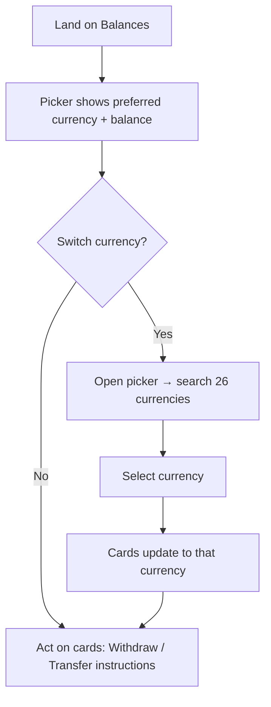

# 01 Top dropdown selector — round 1
updated: 2026-06-25 · Prateek
status: candidate (round 1)
baseline: page-snapshots/balances.html (captured 2026-06-17)
lineage: original
reason: focused round-1 layout for de-verticalizing the currency card — pending designer pick at the confirmation gate
revival trigger: —
screen↔node map: single screen (#combo selector ↔ "Open picker"; cards ↔ "Detail updates")

## Mental model
**Active-currency focus.** The page is about *one* currency at a time. The 26-currency list is demoted into a compact picker; the screen commits its full width to the selected currency's balances.

## Hypothesis
Users land on Balances to act on a specific currency (withdraw, get transfer instructions). They don't need all 26 visible at once — a searchable picker is enough, and removing the column gives every card ~33% more width.

## Pros
- Maximum reclaimed width — the entire left column is gone.
- Search-first scales cleanly to 26 (or more) currencies.
- Familiar combobox pattern; low build cost.

## Cons
- Loses at-a-glance visibility of which currencies hold funds — that now takes a click.
- A power user comparing balances across currencies must open/close the picker repeatedly.

## Best for
Accounts where one or two currencies dominate and the rest are rarely touched.

## Wireframe
*PNG preview could not be rendered in this environment (headless browser unavailable). The `.html` below is the source of truth — open it in a browser.*

[Open the live wireframe](wireframe.html)

## Task flow

