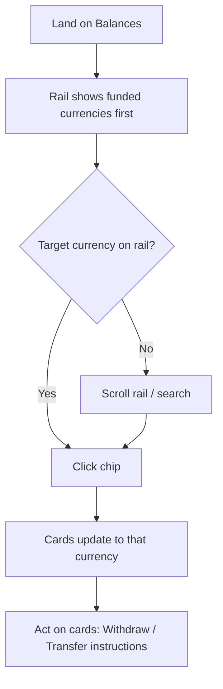

# 02 Horizontal currency rail — round 1
updated: 2026-06-25 · Prateek
status: candidate (round 1)
baseline: page-snapshots/balances.html (captured 2026-06-17)
lineage: original
reason: focused round-1 layout for de-verticalizing the currency card — pending designer pick at the confirmation gate
revival trigger: —
screen↔node map: single screen (rail chips ↔ "Select chip"; cards ↔ "Detail updates")

## Mental model
**Glanceable multi-currency rail.** Currencies stay visible, but laid along a single horizontal, scrollable band across the top instead of a tall column. Cards take the full width beneath.

## Hypothesis
Visibility of balances across currencies is valuable, but it doesn't need a vertical column. A horizontal rail of currency chips (code + balance) keeps the overview while returning the column's width to the content.

## Pros
- Keeps multi-currency balances glanceable — no click to see what holds funds.
- Reclaims the left column width for the cards below.
- Chips can sort funded-first, so the meaningful currencies sit at the start of the rail.

## Cons
- Horizontal scrolling for 26 items is less scannable than a vertical list; relies on sort + search.
- Adds vertical height at the top (the rail band) — a smaller trade than the column, but not zero.

## Best for
Accounts holding funds in several currencies who want a balances-at-a-glance overview without the tall column.

## Wireframe
*PNG preview could not be rendered in this environment (headless browser unavailable). The `.html` below is the source of truth — open it in a browser.*

[Open the live wireframe](wireframe.html)

## Task flow

