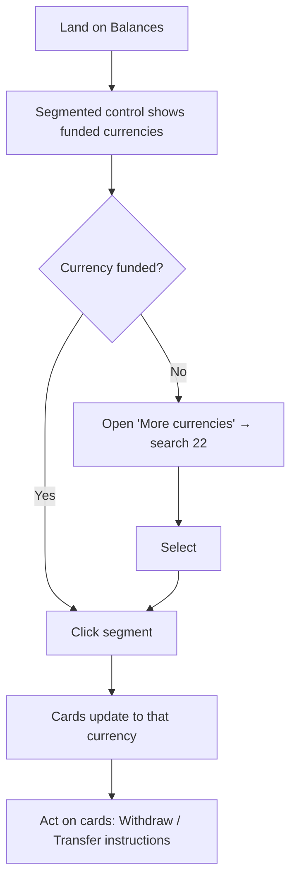

# 03 Segmented + more — round 1
updated: 2026-06-25 · Prateek
status: candidate (round 1)
baseline: page-snapshots/balances.html (captured 2026-06-17)
lineage: original
reason: focused round-1 layout for de-verticalizing the currency card — pending designer pick at the confirmation gate
revival trigger: —
screen↔node map: single screen (segmented control ↔ "Pick funded"; more dropdown ↔ "Open long tail"; cards ↔ "Detail updates")

## Mental model
**Two-tier — funded vs long-tail.** Most of the 26 currencies sit at 0.00. Show only the funded/preferred currencies inline as a horizontal segmented control; tuck the 22 zero-balance currencies behind a "More currencies" dropdown.

## Hypothesis
The vertical column spends most of its height on currencies that hold nothing. Surfacing only funded currencies inline removes that waste, frees the column, and keeps the long tail one click away for the rare case someone needs it.

## Pros
- Strongest signal-to-noise — only currencies that matter are on screen.
- Reclaims the full column width and adds minimal top height (a few segments).
- "More (22 · all 0.00)" label makes the hidden set's state explicit, so nothing feels lost.

## Cons
- "Funded" set can grow; needs a rule for how many segments fit before they collapse into the dropdown.
- Slightly more logic than a flat picker (deciding funded vs long-tail).

## Best for
The common real-world case: a few active currencies plus a long tail of zero balances.

## Wireframe
*PNG preview could not be rendered in this environment (headless browser unavailable). The `.html` below is the source of truth — open it in a browser.*

[Open the live wireframe](wireframe.html)

## Task flow

