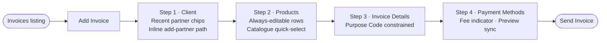
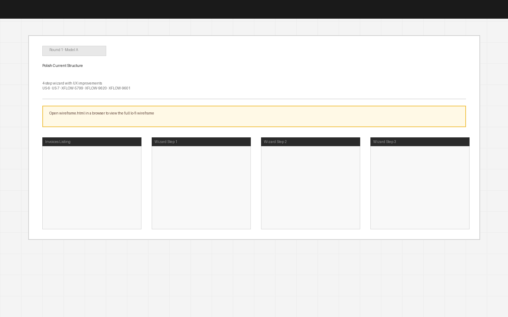

# Round 1 · Model A — Polish Current Structure

**Date:** 2026-06-25  
**Status:** Under review  
**User stories addressed:** US-6, US-7, XFLOW-5799, XFLOW-9620, XFLOW-9601

---

## Hypothesis

The 4-step wizard structure is fundamentally sound. Drop-off at Partner Selection (−52%) and Item Entry (−41%) is caused by interaction friction within those steps, not by the wizard paradigm itself. Fix the friction inside each step, fix the three in-scope bugs, and conversion recovers without a structural overhaul.

---

## What changes in this model

**Step 1 — Client (US-6 · new)**  
- Recent and frequent partners surfaced as one-click chips above the search field  
- Empty state for first-time users provides an inline "Add new partner" path — no modal abandon required  
- Partner selection is faster and unblocked

**Step 2 — Products (US-7 · changed)**  
- Line items are always-editable inline rows — no per-row Save/Cancel gate  
- Catalogue items appear in the dropdown for quick selection  
- Subtotal updates live; add-row affordance is immediately visible

**Step 3 — Invoice Details (XFLOW-5799 · fixed)**  
- Purpose Code select is constrained to container width with text-overflow: ellipsis  
- Same constraint applied to all selects in the step

**Step 4 — Payment Methods (XFLOW-9620 · new, XFLOW-9601 · fixed)**  
- Inline fee indicator below Card Payments toggle explains who bears the processing fee and links to Settings  
- Live preview panel is bound to real-time toggle state — bank details disappear from preview the instant Bank is toggled off

---

## Task flow (Mermaid)

---

## Screens

→ [Open wireframe.html](wireframe.html) for the full interactive lo-fi

---

## Trade-offs

| Upside | Downside |
|--------|----------|
| Minimal migration risk — same mental model, same nav | 4 steps still feels like a commitment if users just want to try |
| Targeted fixes map 1-to-1 to known drop-off causes | Doesn't test whether paradigm itself is a problem (US-8) |
| Safest: if conversion improves, we know which fix did it | Items + partner are still split — two separate "enter data" moments |
