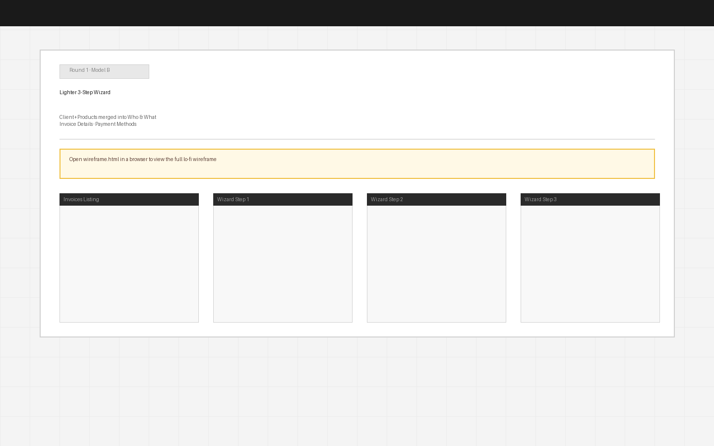

# Round 1 · Model B — Lighter 3-Step Wizard

**Date:** 2026-06-25  
**Status:** Under review  
**User stories addressed:** US-6, US-7, US-8 (paradigm), XFLOW-5799, XFLOW-9620, XFLOW-9601

---

## Hypothesis

Merging Client and Products into a single "Who & What" step reduces the perceived commitment of the wizard from 4 steps to 3. The user lands on the most critical data entry — partner + items — in one screen, which reflects the natural mental model of "I'm invoicing Acme Corp for this work." The commit-then-specify sequence of the current design (pick partner, *then* add items) adds a false step boundary.

---

## What changes in this model

**Step 1 — Who & What (US-6 + US-7 · merged)**  
- Partner chips (recent/frequent) at top — same as Model A  
- Items entry immediately below the partner selector — no step boundary  
- Single currency picker, always-editable rows, live subtotal  
- Filling both sections in one pass is the expected happy path

**Step 2 — Invoice Details (XFLOW-5799 · fixed)**  
- Purpose Code select constrained to container width  
- Same as Model A Step 3

**Step 3 — Payment Methods (XFLOW-9620 · new, XFLOW-9601 · fixed)**  
- Fee indicator inline below Card Payments  
- Preview synced to toggle state  
- Same as Model A Step 4

---

## Task flow (Mermaid)

---

## Screens

→ [Open wireframe.html](wireframe.html) for the full interactive lo-fi

---

## Trade-offs

| Upside | Downside |
|--------|----------|
| Step count drops 4 → 3 — lower perceived funnel depth | Step 1 is now longer; users may not scroll to see item entry |
| Partner + item entry in one pass matches natural mental model | Longer scroll on small screens (though create-invoice is desktop-first) |
| All existing bug fixes carried over from Model A | Still has a "Next" gate after items — some friction remains |
| Easily reversible split if A/B test favours separation | Scroll position management matters for UX polish in prototype |
