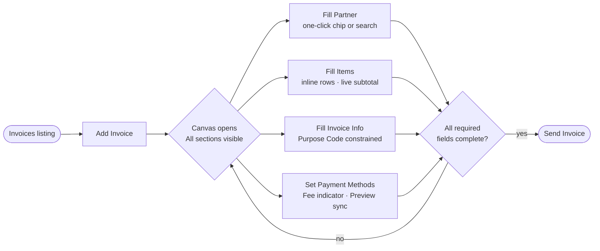
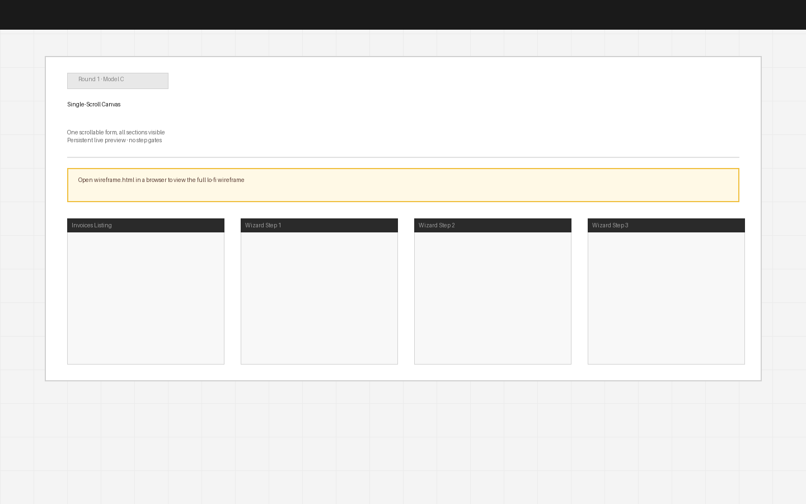

---
---
# Round 1 · Model C — Single-Scroll Canvas

**Date:** 2026-06-25  
**Status:** Under review  
**User stories addressed:** US-6, US-7, US-8 (paradigm), XFLOW-5799, XFLOW-9620, XFLOW-9601

---

## Hypothesis

The wizard paradigm itself creates anxiety by showing the user a gated funnel of unknown length. Replace the step-by-step wizard with a single continuous form (a "canvas") where all four sections are always visible and scrollable. The Send button unlocks when all required fields are complete. The user never hits a "Next" gate — they fill in any order, at any pace, and see the invoice build live on the right at every keystroke.

---

## What changes in this model

**Structural change (US-8)**  
- No step indicator, no "Next" buttons  
- All four sections — Partner, Items, Invoice Details, Payment Methods — are consecutive cards in a single scrollable left panel  
- Anchor nav pills at the top let users jump to any section without scrolling  
- A continuous progress bar reflects completion across all required fields  
- Send button remains disabled (greyed) until all required fields are filled; once complete it becomes active

**Partner section (US-6)**  
- Recent partner chips immediately visible — one click to select  
- Partner field collapses to a read-only summary once filled, keeping the canvas compact

**Items section (US-7)**  
- Always-editable inline rows, live subtotal — same frictionless entry as Models A and B

**Invoice Info section (XFLOW-5799)**  
- Purpose Code select constrained to container width — same fix as Models A and B

**Payment Methods section (XFLOW-9620 · new, XFLOW-9601 · fixed)**  
- Fee indicator below Card toggle  
- Preview synced to toggle state at all times (always visible = always trusted)

**Live preview (XFLOW-9601)**  
- Preview is persistent from the moment the canvas opens — never hidden, always in sync  
- The user sees the invoice grow as they type, not just at payment step

---

## Task flow (Mermaid)

---

## Screens

→ [Open wireframe.html](wireframe.html) for the full interactive lo-fi  
The HTML shows two states: (1) early state — partner selected, items in progress; (2) complete state — all sections filled, Send unlocked.

---

## Trade-offs

| Upside | Downside |
|--------|----------|
| No funnel anxiety — user sees the full scope upfront | No clear progress signal while filling (addressed by anchor nav + progress bar) |
| Fill in any order — suits users who know their invoice number before their partner | Longer scroll in single column; some users may not see payment section |
| Preview is always visible — fee & preview sync surprises disappear | Harder to enforce sequential validation (e.g. currency must be set before items) |
| One screen = one mental context, no step transitions | More UI state to manage (section completion, anchor tracking, Send unlock logic) |
| Most differentiated paradigm — tests US-8 cleanly | Highest implementation delta from current design |
